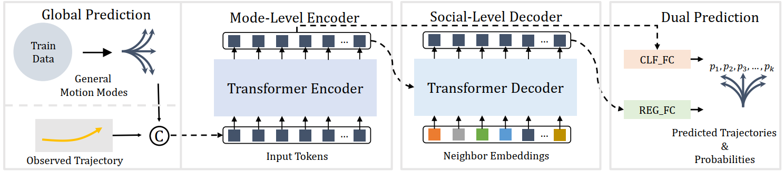
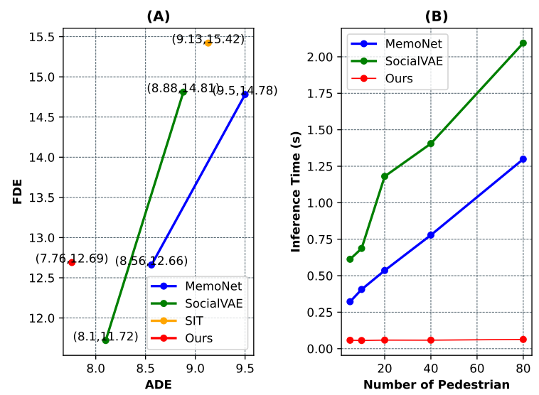
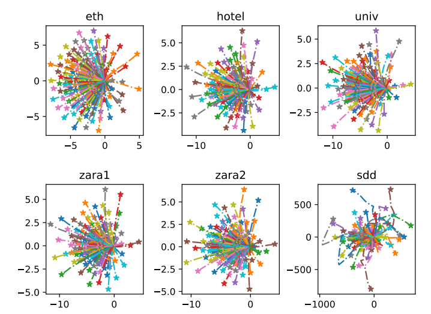
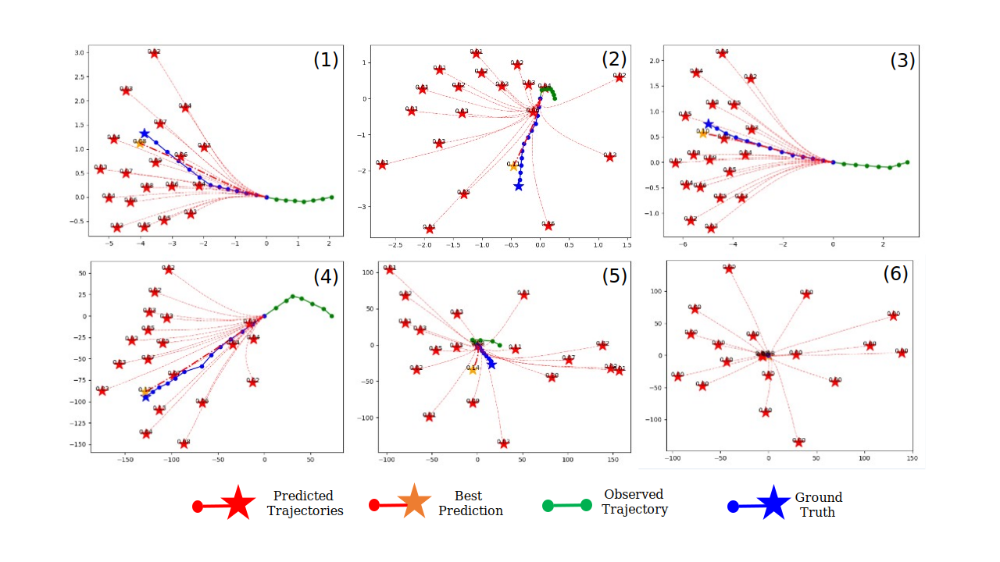

# TUTR: Trajectory Unified Transformer for Pedestrian Trajectory Prediction

This is the official implementation for _**TUTR: Trajectory Unified Transformer for Pedestrian Trajectory Prediction**_. [[Paper](https://openaccess.thecvf.com/content/ICCV2023/papers/Shi_Trajectory_Unified_Transformer_for_Pedestrian_Trajectory_Prediction_ICCV_2023_paper.pdf)] 

_**Abstract**_ -- Pedestrian trajectory prediction is an essential link to understanding human behavior. Recent work achieves state-of-the-art performance gained from hand-designed post-processing, e.g., clustering.  However, this post-processing suffers from expensive inference time and neglects the probability that the predicted trajectory disturbs downstream safety decisions. In this paper, we present Trajectory Unified TRansformer, called TUTR, which unifies the trajectory prediction components, social interaction, and multimodal trajectory prediction, into a transformer encoder-decoder architecture to effectively remove the need for post-processing. Specifically, TUTR parses the relationships across various motion modes using an explicit global prediction and an implicit mode-level transformer encoder. Then, TUTR attends to the social interactions with neighbors by a social-level transformer decoder.  Finally, a dual prediction forecasts diverse trajectories and corresponding probabilities in parallel without post-processing. TUTR achieves state-of-the-art accuracy performance and improvements in inference speed of about $10 \times $ - $40 \times$ compared to previous well-tuned state-of-the-art methods using post-processing.


    @InProceedings{Shi_2023_ICCV,
        author    = {Shi, Liushuai and Wang, Le and Zhou, Sanping and Hua, Gang},
        title     = {Trajectory Unified Transformer for Pedestrian Trajectory Prediction},
        booktitle = {Proceedings of the IEEE/CVF International Conference on Computer Vision (ICCV)},
        month     = {October},
        year      = {2023},
        pages     = {9675-9684}
    }


## framework
TUTR employs an encoder-decoder transformer architecture to forecast future motion behaviors.Firstly, the global prediction generates general motion modes.Then, the general motion modes concatenated with the observed embedding are considered as the input tokens of a mode-level transformer encoder.Subsequently, the encoder output attends to the social interactions by a social-level decoder.Finally, two shared prediction heads in dual prediction are used to obtain the dual results, predicted trajectories and corresponding probabilities.



## performance & speed
TUTR achieves a balance between accuracy and inference speed. 

 

(A) is the performance comparison between TUTR and other SOTA methods, where the line segments of MemoNet and SocialVAE are the performance changing with post-processing or not.
(B) is the speed comparison between the TUTR and the post-processing methods.

## visualization

### Motion Modes 

 

### Prediction




## Dependencies
python=3.7.12=hf930737_100_cpython

numpy==1.19.0

scikit-learn==1.0.2

torch==1.12.1+cu113

torchvision==0.13.1+cu113

## Dataset

Please download the [dataset](https://drive.google.com/drive/folders/1hpXNypqYVz_XnrnJSlcM8ogfQSA7utct?usp=drive_link) and extract it into the directory './dataset/' like this:

```
./dataset/sdd_train.pkl/
./dataset/sdd_test.pkl/
```

## train && evaluation (GPU VERSION)

    $ python train.py --dataset_name <dataset_name> --hp_config <config_file> --gpu <sdd_index>

Example for the ETH-UCY and dataset :

    python train.py --dataset_name sdd --hp_config config/sdd.py --gpu 0
    python train.py --dataset_name eth --hp_config config/eth.py --gpu 0
    python train.py --dataset_name hotel --hp_config config/hotel.py --gpu 0
    python train.py --dataset_name univ --hp_config config/univ.py --gpu 0
    python train.py --dataset_name zara1 --hp_config config/zara1.py --gpu 0
    python train.py --dataset_name zara2 --hp_config config/zara2.py --gpu 0


## Acknowledgement
The pre-processed datasets are obtained from the dataloader of [[SocialVAE](https://github.com/xupei0610/SocialVAE)].

You can generate pkl-dataset like this:

    python get_data_pkl.py --train data/eth/train --test data/eth/test --config config/eth.py

Other datasets can be obtained to modify the corresponding dataset names, such as:

     python get_data_pkl.py --train data/sdd/train --test data/sdd/test --config config/sdd.py

    
## License
This repository is licensed under Apache 2.0.
